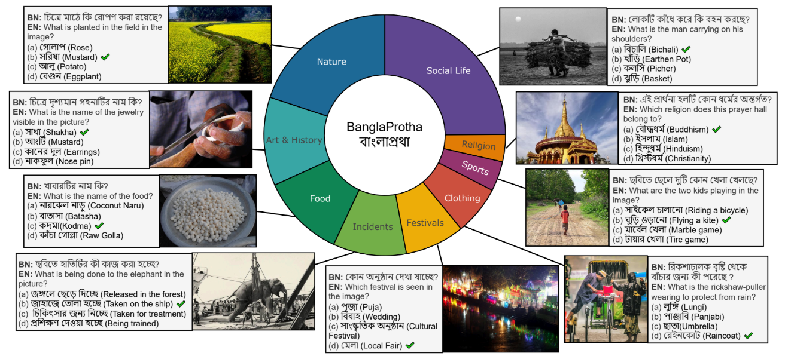

<div align="center">

# BanglaProtha: Evaluating Vision Language Models in Underrepresented Long-tail Cultural Contexts

</div>

<p align="center">
  <strong>Md Fahim*</strong>, <strong>Md Sakib Ul Rahman*</strong>, <strong>Akm Moshiur Rahman*</strong>, <strong>Md Farhan Ishmam*</strong>, <strong>Md Tasmim Rahman</strong>, <strong>Fariha Tanjim Shifat</strong>, <strong>Fabiha Haider</strong>, <strong>Md Farhad Alam Bhuiyan</strong>
</p>

<div align="center">

[![arXiv](https://img.shields.io/badge/WACV_2026-68448b?style=flat&logoColor=white&color=68448b&labelColor=FFFFFF&logo=data:image/svg+xml;base64,PHN2ZyB4bWxucz0iaHR0cDovL3d3dy53My5vcmcvMjAwMC9zdmciIHdpZHRoPSIxNjAiIGhlaWdodD0iMTYwIj48cGF0aCBmaWxsPSIjNzJBMENFIiBkPSJNMTA4IDI3aDUydjE1aC0zM3YxOGgxOGwuMDYzIDcuNDM4LjAyNyAyLjM0NWMuMDA3IDEuNzQtLjA0IDMuNDc4LS4wOSA1LjIxNy0xIDEtMSAxLTQuODE2IDEuMDk4YTcwNSA3MDUgMCAwIDEtNC43NDYtLjAzNUwxMjcgNzZ2MzNoLTE5bC0xLTQzYy03LjMyMyAxNS42OTEtMTQuNTggMzEuMzk3LTIxLjU5NiA0Ny4yMjctMi45NzIgNi42OC02LjA2MSAxMy4yNy05LjQwNCAxOS43NzMtMy0xLTMtMS00LjI5NC0zLjAxOGwtMS4zMDYtMi42OTEtMS40OTktMy4wNDktMS42LTMuMzM2LTEuNjc5LTMuNDM4YTIzNjYgMjM2NiAwIDAgMS00LjQxNC05LjExNWMtMS40NjItMy4wMjYtMi45MzYtNi4wNDctNC40MS05LjA2OEE0MjExIDQyMTEgMCAwIDEgNDcgNzlsLTEuMzYtMi44MjdxLTEuNzQzLTMuNjMtMy40NzItNy4yNjdsLTEuMDAxLTIuMDg2QzM5IDYyLjIzMyAzOSA2Mi4yMzMgMzkgNjBoMTljMTYgMzAuMjMgMTYgMzAuMjMgMTYgMzNoMmwxLjE0NS0zLjcxNWMyLjA1Mi02LjE1OCA0Ljc5OC0xMS45NzMgNy41NDMtMTcuODQ3LjUxLTEuMTA1IDEuMDIyLTIuMjA5IDEuNTQ4LTMuMzQ2UTg4LjExMyA2NC4wNDMgOTAgNjBoMTh6Ii8+PHBhdGggZmlsbD0iIzZCOUJDQyIgZD0iTTYwLjYyNSAzMy4yNSA2MyAzNWMtMS41MzIgMy41ODQtMy42NjcgNi4wMjktNi4zNzUgOC44MTNsLTIuMzM2IDIuNDU3QzUyIDQ4IDUyIDQ4IDQ5Ljg4NyA0Ny44MjhMNDggNDdjLTYuNzA0LTIuNTMzLTEyLjQyNi0yLjg2LTE5LjA3OC0uMTAyLTUuMzAxIDMuMDM5LTguNjA3IDguMjE2LTEwLjQ1IDEzLjk0MkMxNi43MzkgNjguNzY4IDE3Ljg5IDc1Ljk5IDIyIDgzYzMuODQ2IDQuNjA4IDguMDEzIDcuMTE3IDE0IDggNC4wMjYtLjE0NyA4LjAwMS0uNTE0IDEyLTFxMS43NTcgMy40MzUgMy41IDYuODc1bDEuMDEyIDEuOTczQzU1IDEwMy43NzMgNTUgMTAzLjc3MyA1NSAxMDZjLTguNjMyIDQuNDA4LTE5LjA5OCA0LjM5Ni0yOC40MTggMi4xOTEtMTAuNDMyLTMuOS0xNy45MDEtMTEuMDk2LTIzLjQyNi0yMC42MzZDLTEuNzE1IDc2Ljc5LTIuMjYyIDYxLjUgMS44NzUgNTAuMzc1YzUuNTI5LTEwLjg3MSAxNC4zOTEtMTguOTk3IDI1LjkzOC0yMy4wMDQgMTEuODkzLTIuMDE4IDIyLjY1Mi0uNjkxIDMyLjgxMiA1Ljg3OSIvPjxwYXRoIGZpbGw9IiM2Mjk1Q0EiIGQ9Ik0xMDkgMjhoNTB2MTNoLTMzdjIwaDE5djE0aC0xOXYzM2gtMTd6Ii8+PHBhdGggZmlsbD0iIzk1QjhEQSIgZD0iTTM5IDYwaDE5djNsLTMtMWMtMi4zOTUtLjA3LTQuNzkyLS4wODQtNy4xODctLjA2MmwtMy44NTYuMDI3TDQxIDYybC0xIDJ6Ii8+PC9zdmc+&style=flat&logoWidth=15)](https://openaccess.thecvf.com/content/WACV2026/papers/Fahim_BanglaProtha_Evaluating_Vision_Language_Models_in_Underrepresented_Long-tail_Cultural_Contexts_WACV_2026_paper.pdf)
[](https://github.com/farhanishmam/BanglaProtha)
[](https://www.kaggle.com/datasets/sourove/bangla-culturally-relevant-vqa)

</div>

---

<strong>tldr.</strong> A VQA dataset with images and questions relevant to the Bengali culture.

<p align="center">
  
</p>

## Setup

- Download the test images and put them in `data\images`.
- Inside `data` folder put the model test json file as `test_set_predictions.json`.
- Install the following packages using:

```bash
pip install vllm
```

## Usage

Run the following command in the terminal:

```bash
python infer.py --model-type <model_name>
# python infer.py --model-type qwen2_5_vl
```

**Note:** See the `model_example_map` dict (Line 1028) in `infer.py` for model types.
